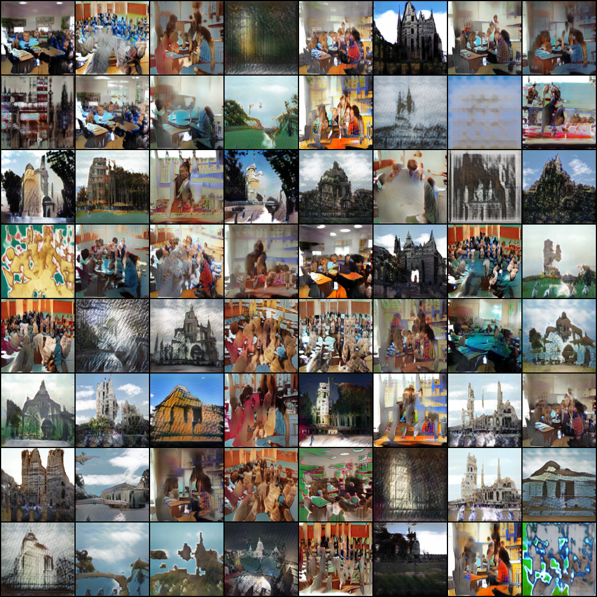
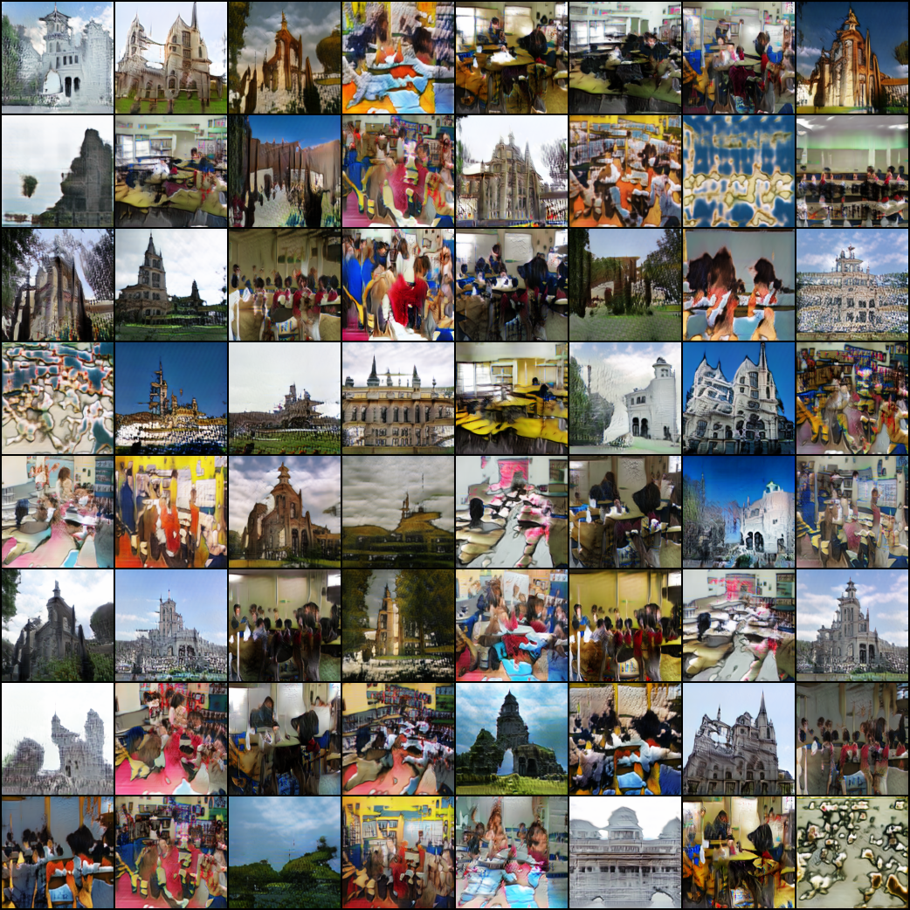
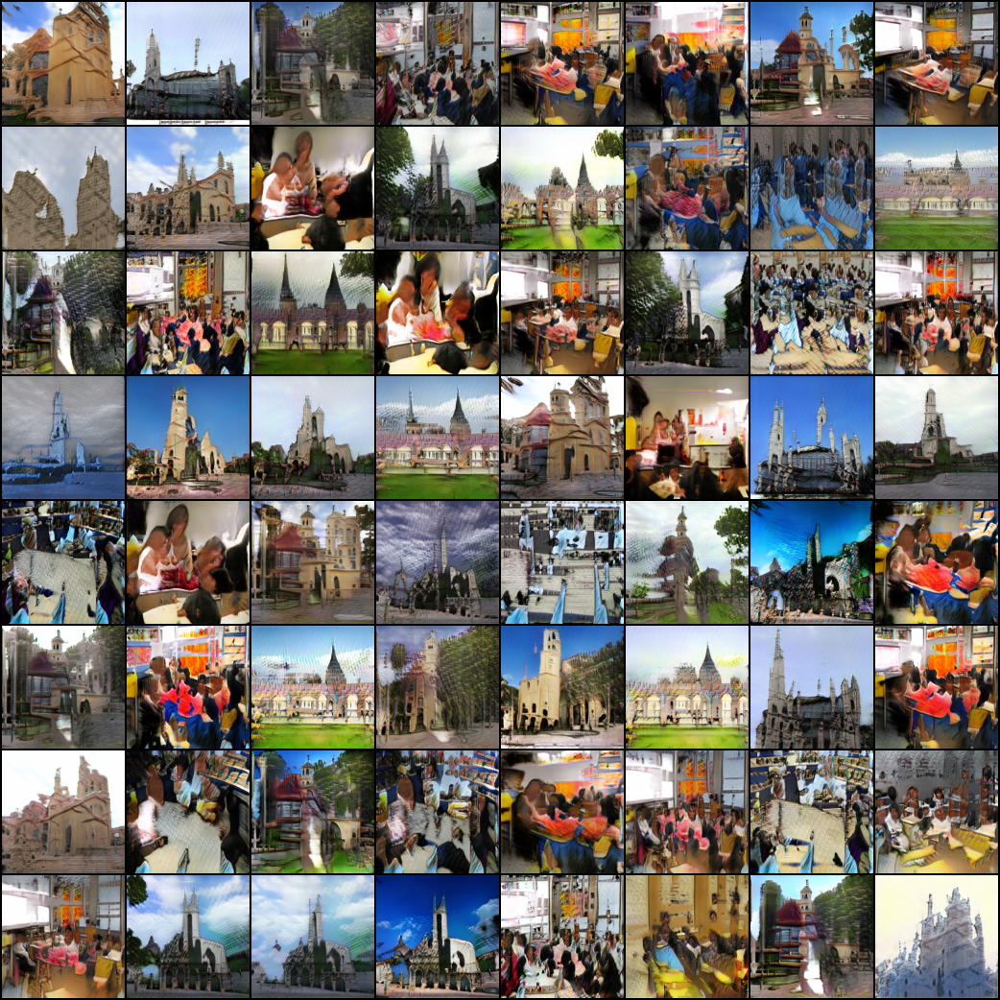
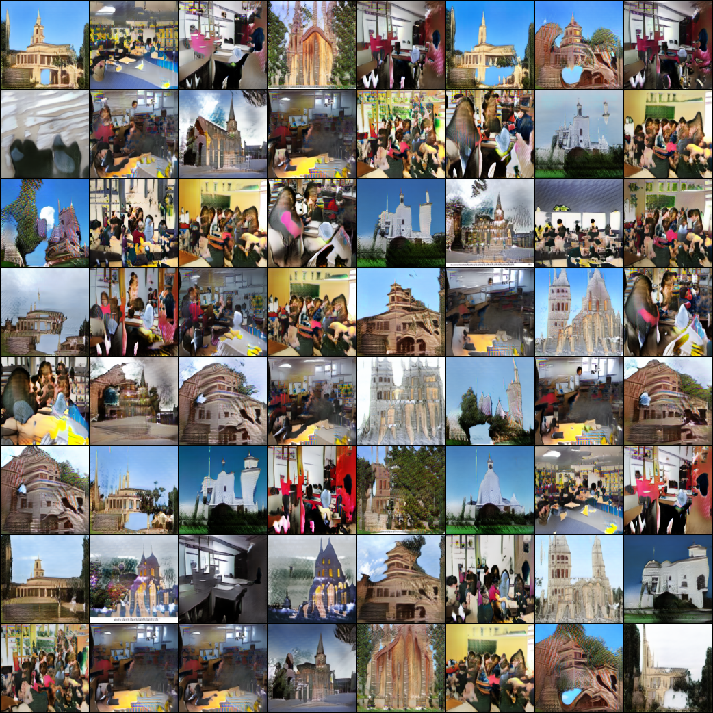
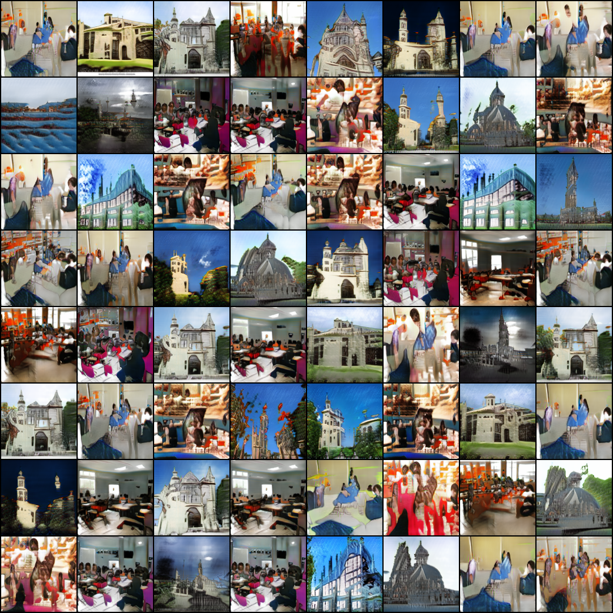

# BigGAN-PyTorch

Pytorch implementation of LARGE SCALE GAN TRAINING FOR HIGH FIDELITY NATURAL IMAGE SYNTHESIS (BigGAN)

## train imagenet

for 128\*128\*3 resolution

    python main.py --batch_size 64  --dataset imagenet --adv_loss hinge --version biggan_imagenet --image_path /data/datasets

    python main.py --batch_size 64  --dataset lsun --adv_loss hinge --version biggan_lsun --image_path /data1/datasets/lsun/lsun

    python main.py --batch_size 64  --dataset lsun --adv_loss hinge --version biggan_lsun --parallel True --gpus 0,1,2,3 --use_tensorboard True

## Different

* not use cross-replica BatchNorm (Ioffe & Szegedy, 2015) in G

## Compatability

* CPU 
* GPU

## Pretrained Models

LSUN Pretrained model
[Download](https://drive.google.com/open?id=1wevnhx98Okhz3Yysu4sHN3ogTeEhkun5)

Some methods in the paper to avoid model collapse, please see the paper and retrain your model.

## Performance

* Infact, as mentioned in the paper, the model will collapse 
* I use LSUN datasets to train this model maybe cause bad performance due to the class of classroom is more complex than ImageNet

## Results

LSUN DATASETS(two classes): classroom and church_outdoor
* iter 82200 (128x128) batch_size 64

* iter 128200

* iter 365000

* iter 800000

* iter 900000

